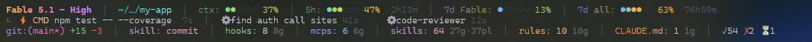

<h1 align="center">claude-statusline</h1>

<p align="center">
  A status line for <a href="https://code.claude.com">Claude Code</a> that shows what the session is actually doing:<br>
  model and effort, context and rate-limit meters, the tool running right now, live subagents,<br>
  git state, the active skill, and how much configuration Claude is carrying.<br>
  One file, Node only, no dependencies, truecolor gradients.
</p>

<p align="center">
  
</p>

<p align="center">
  <sub>Every row lit up, rendered by <code>demo/preview.mjs</code> in Windows Terminal. Below: the same script in a real session.</sub>
</p>

<p align="center">
  
</p>

## What it shows

Rows appear only when they have something to say: a plain session is one or two lines, a busy one
is three.

**Row 1 — the session**

| Segment | What it is |
|---|---|
| `Fable 5.1 - High` | model display name plus the live effort level, gold → pink → purple |
| `~/…/my-app` | working directory, shortened to what identifies it (`~/x/y`, `/…/leaf`, `Volume:…/leaf`) |
| `ctx: ●●○○○○ 37%` | context window used, green → yellow → coral as it fills |
| `5h: ●●●○○○ 47%  2h13m` | five-hour rate limit and time until it resets |
| `7d Fable: ●○○○○○ 13%` | the per-model weekly limit, when your plan has one |
| `7d all: ●●●●○○ 63%  76h59m` | the all-models weekly limit and its reset |

**Row 2 — what is running** (only while a tool is in flight)

```
⠦ ⚡ CMD npm test -- --coverage  7s  │  ⚙ find auth call sites 41s  ·  ⚙ code-reviewer 12s
```

A spinner, the tool's category (`CMD`, `SYS`, `MCP`, `AGT`, `WEB`, `SKL`, `DSC`, `TASK`, `TODO`, `NB`,
`CRON`), a short description, and how long it has been running. Subagents spawned by the Agent tool
follow on the same row with their own timers.

**Row 3 — environment**

```
git:(main*) +15 -3  │  skill: commit  │  hooks: 2 2g  │  mcps: 6 6g  │  skills: 64 27g·37pl  │  rules: 10 10g  │  CLAUDE.md: 1 1g  │  ✓54 ✗2 ⏳1
```

- **git** — branch, `*` when dirty, lines added and removed against `HEAD`.
- **skill** — the skill whose context is currently in play, read from Claude Code's own attribution
  field in the transcript, so slash-invoked skills show too and it disappears when the skill's
  influence ends.
- **hooks / mcps / skills / rules / CLAUDE.md** — how much configuration is loaded, with a dim scope
  tag: `g` from `~/.claude`, `pl` from active plugins, `p` from the project. Hooks are counted per
  command, MCP servers are deduplicated across scopes, plugin skills come from the versions that are
  actually installed rather than everything in the cache.
- **✓ ✗ ⏳** — tool calls this session that succeeded, failed, or are still pending.

Every row is fitted to the terminal width. When a row overflows, the least important segments go
first (the path, then the weekly meters) and the model and context meter survive longest.

## Install

Requires Node 18+ and a terminal with truecolor support (Windows Terminal, iTerm2, Ghostty, kitty,
WezTerm, Alacritty, Apple Terminal with 24-bit colour, most Linux emulators).

1. Copy `statusline.mjs` to `~/.claude/statusline.mjs`.
2. Add to `~/.claude/settings.json`:

   ```json
   "statusLine": {
     "type": "command",
     "command": "node ~/.claude/statusline.mjs",
     "padding": 0,
     "refreshInterval": 5
   }
   ```

   On Windows use full paths and escape the backslashes:

   ```json
   "command": "\"C:\\Program Files\\nodejs\\node.exe\" \"C:\\Users\\you\\.claude\\statusline.mjs\""
   ```

3. Restart Claude Code, or open `/config` once, to reload.

That gives you rows 1 and 3. The active-tool row and the ✓ ✗ ⏳ counters need the hook below.

### Hook for the active-tool row and session counters

`hooks/tool-tracker.mjs` is a single script that handles six hook events and writes a tiny data
layer the status line reads. Copy it to `~/.claude/hooks/tool-tracker.mjs` and add to the same
`settings.json`:

```json
"hooks": {
  "PreToolUse":         [{ "hooks": [{ "type": "command", "command": "node ~/.claude/hooks/tool-tracker.mjs", "timeout": 2000 }] }],
  "PostToolUse":        [{ "hooks": [{ "type": "command", "command": "node ~/.claude/hooks/tool-tracker.mjs", "timeout": 2000 }] }],
  "PostToolUseFailure": [{ "hooks": [{ "type": "command", "command": "node ~/.claude/hooks/tool-tracker.mjs", "timeout": 2000 }] }],
  "SubagentStart":      [{ "hooks": [{ "type": "command", "command": "node ~/.claude/hooks/tool-tracker.mjs", "timeout": 2000 }] }],
  "SubagentStop":       [{ "hooks": [{ "type": "command", "command": "node ~/.claude/hooks/tool-tracker.mjs", "timeout": 2000 }] }],
  "SessionStart":       [{ "hooks": [{ "type": "command", "command": "node ~/.claude/hooks/tool-tracker.mjs", "timeout": 2000 }] }]
}
```

If you already have hooks for those events, add the command to the existing arrays. On Windows use
the same full, escaped paths as the `statusLine` command. The hook never blocks: it exits 0 whatever
happens. It writes to `%TEMP%\claude-statusline` on Windows and `/tmp/claude-statusline`
elsewhere, or to `CLAUDE_STATUSLINE_DIR` if that is set (set it for the status line too).

## Preview it

```
node demo/preview.mjs
```

Renders the status line in your terminal with every row active: a throwaway git repo with
uncommitted changes, a running tool, two subagents, an active skill, and demo meter values. The
configuration counts are read from your real `~/.claude`, so that part is yours. Only
`os.tmpdir()/claude-statusline-demo` is touched. `DEMO_MODEL`, `DEMO_EFFORT`, `DEMO_CTX`, `DEMO_5H`
and `DEMO_7D` override the demo values.

## How it works

- **Input.** Claude Code pipes a JSON payload to the command on every refresh: model, effort, cwd,
  transcript path, context-window usage and, in current versions, the five-hour and seven-day rate
  limits. The script reads all of it from stdin.
- **Per-model weekly limit.** The stdin payload does not carry it, so the script asks the same usage
  endpoint the claude.ai usage tab uses, authenticated with the OAuth token Claude Code already stores
  (macOS keychain or `~/.claude/.credentials.json`). The answer is cached for 30 s in
  `~/.claude/statusline-cache/`, and the last good answer is kept if the request fails. When stdin
  carries rate limits, those win for the two shared meters. If you would rather not have the script
  read the token, delete `getOAuthToken`; the meters keep working from stdin.
- **Cheap refreshes.** Git subprocesses are cached for 10 s and the configuration walk for 5 min,
  keyed by cwd, so a 5 s refresh interval costs almost nothing. The transcript is tail-read (last
  128 KB) rather than parsed whole.
- **Width.** Claude Code exports `COLUMNS`; the script measures visible width with ANSI escapes
  stripped and drops or crops segments to fit.
- **Windows.** Pure-JS directory walks (no `find`), symlinks and NTFS junctions followed, paths
  normalised so the cache keys match however cwd is spelled.

## Files

| File | Role |
|---|---|
| `statusline.mjs` | the status line |
| `hooks/tool-tracker.mjs` | hook feeding the active-tool row, subagent list and session counters |
| `demo/preview.mjs` | renders every row in your terminal with demo state |
| `docs/` | the screenshots above |

## License

MIT
